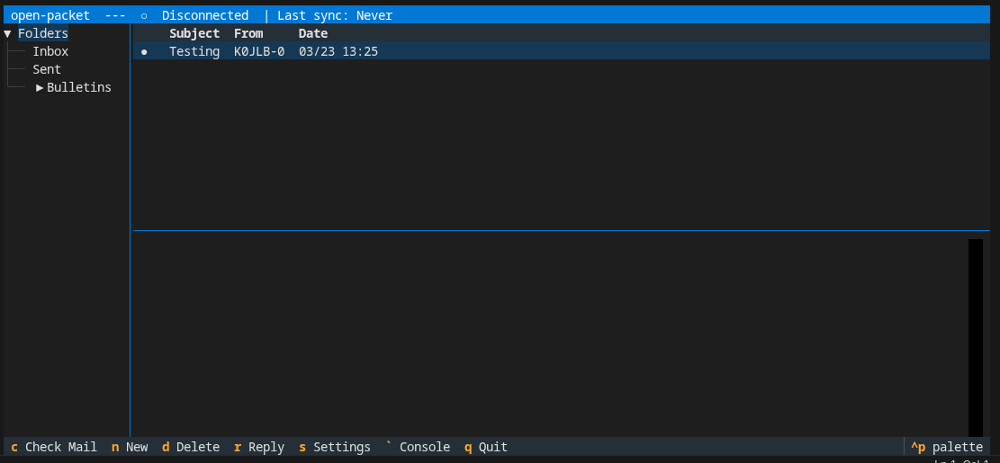

# open-packet

An open-source packet messaging client for amateur radio operators.

> **Early development:** v0.1 — expect breaking changes between releases.



---

## Quickstart

**Requirements:**
- Linux (macOS and Windows are not currently supported)
- Python >= 3.11
- A KISS-capable TNC connected via TCP or serial port. If you don't have hardware, [Direwolf](https://github.com/wb2osz/direwolf) is a good software TNC.

**Install:**

```bash
uv tool install git+https://github.com/YOUR_USERNAME/open-packet
```

**Configure:**

Create `~/.config/open-packet/config.yaml`:

```yaml
connection:
  type: kiss_tcp          # kiss_tcp | kiss_serial
  host: localhost         # TCP only
  port: 8001              # TCP only
  # device: /dev/ttyUSB0  # serial only
  # baud: 9600            # serial only

store:
  db_path: ~/.local/share/open-packet/messages.db
  export_path: ~/.local/share/open-packet/export

ui:
  console_visible: false
  console_buffer: 500     # ring buffer size (lines)
  # console_log: ~/.local/share/open-packet/console.log  # omit to disable
```

**Run:**

```bash
open-packet
```

On first launch, you'll be prompted to enter your callsign and BBS node details. You can update these later via the Settings screen (`s`).

---

## How It Works

open-packet connects to a BBS node over AX.25 packet radio via a KISS TNC, syncing your personal messages and bulletins to a local SQLite database. The core engine is interface-agnostic — the terminal client is the first frontend, with a web client and other interfaces planned.

---

## Configuration

The config file lives at `~/.config/open-packet/config.yaml` (or pass a custom path as the first argument to `open-packet`).

```yaml
connection:
  type: kiss_tcp          # kiss_tcp | kiss_serial
  host: localhost         # TCP only
  port: 8001              # TCP only
  # device: /dev/ttyUSB0  # serial only
  # baud: 9600            # serial only

store:
  db_path: ~/.local/share/open-packet/messages.db    # SQLite message database
  export_path: ~/.local/share/open-packet/export     # flat-file export directory

ui:
  console_visible: false       # show AX.25 frame console on startup
  console_buffer: 500          # number of lines to keep in the console ring buffer
  # console_log: ~/.local/share/open-packet/console.log  # log frame traffic to file (omit to disable)
```

Operator identity (callsign, SSID) and BBS node configuration are managed interactively through the TUI rather than in the config file. Access them via the Settings screen (`s`).

---

## Development

```bash
# Clone and install dependencies
git clone https://github.com/YOUR_USERNAME/open-packet.git
cd open-packet
uv sync

# Run the app
uv run open-packet

# Run tests
uv run pytest

# Run with Textual's dev tools (live reload + DOM inspector)
# Note: this launches OpenPacketApp directly, bypassing main() — config loads from the default path
uv run textual run --dev open_packet/ui/tui/app.py
```

---

## Contributing

Contributions are welcome.

- Fork the repo and create a feature branch
- Write tests for new functionality
- Run `uv run pytest` before opening a pull request
- Open a pull request with a clear description of the change

---

## License

MIT — see [LICENSE](LICENSE) for details.
